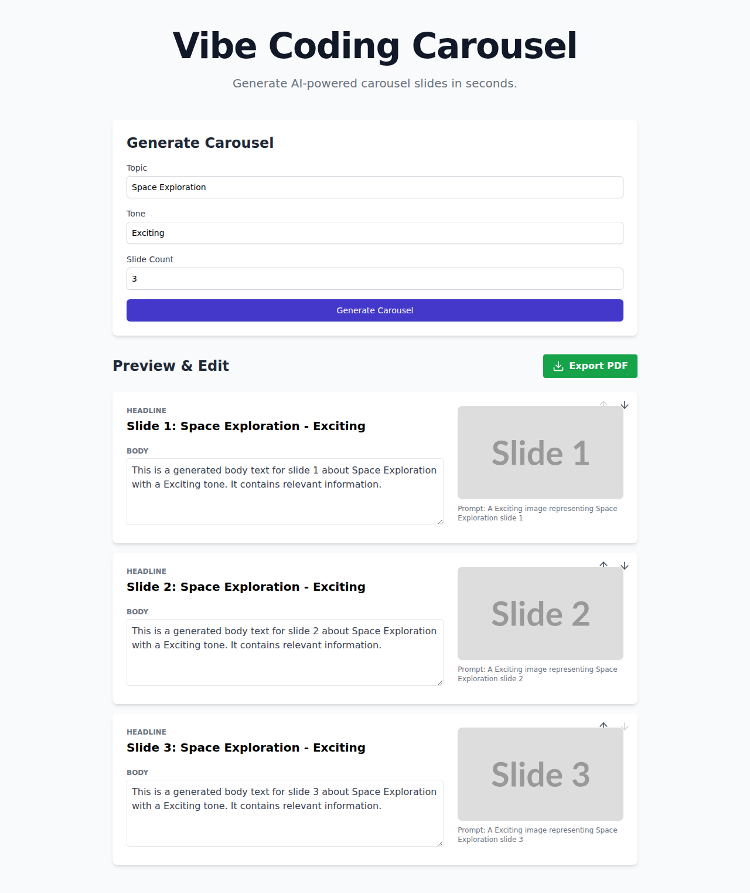
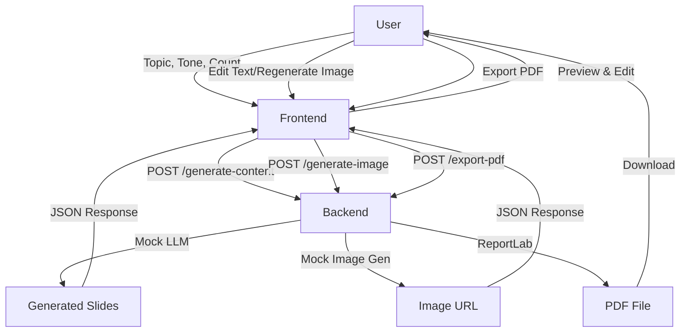

# Vibe Coding Carousel - AI Slide Generator



## Project Overview

Vibe Coding Carousel is an AI-powered tool designed to generate professional carousel slides instantly. It takes a user's input (Topic, Tone, and Slide Count) and leverages mock AI models to produce engaging headlines, body text, and relevant visuals. Users can review, edit, and export the final carousel as a high-quality PDF.

### Key Features
*   **AI Content Generation**: Generates topic-relevant headlines and body text based on tone.
*   **AI Image Generation**: Automatically creates visual prompts and fetches mock images.
*   **Interactive Editor**: Edit text and regenerate images directly in the preview.
*   **PDF Export**: Download the complete carousel as a formatted PDF with metadata.
*   **Responsive Design**: Works seamlessly on desktop and tablet.

## Tech Stack

*   **Frontend**:
    *   React 18
    *   Vite
    *   Tailwind CSS
    *   Axios
    *   Lucide React (Icons)
*   **Backend**:
    *   FastAPI (Python)
    *   Uvicorn
    *   Pydantic
    *   ReportLab (PDF Generation)

## Architecture



## Setup & Installation

### Prerequisites
*   Python 3.8+
*   Node.js 14+
*   `pip` and `npm`

### 1. Backend Setup
Navigate to the `backend` directory and install dependencies:
```bash
cd backend
pip install -r requirements.txt
```

### 2. Frontend Setup
Navigate to the `frontend` directory and install dependencies:
```bash
cd frontend
npm install
```

## Usage Instructions

### 1. Start the Backend Server
From the project root:
```bash
export PYTHONPATH=$PYTHONPATH:$(pwd)/backend
python3 -m uvicorn backend.main:app --reload
```
The backend will run on `http://localhost:8000`.

### 2. Start the Frontend Application
From the `frontend` directory:
```bash
cd frontend
npm run dev
```
The frontend will run on `http://localhost:5173`.

### 3. Generate a Carousel
1.  Open your browser and navigate to `http://localhost:5173`.
2.  Enter a **Topic** (e.g., "The Future of Space Travel").
3.  Enter a **Tone** (e.g., "Inspirational").
4.  Set the **Slide Count** (1-10).
5.  Click **Generate Carousel**.

### 4. Edit & Export
1.  Review the generated slides.
2.  Edit any headline or body text directly in the card.
3.  Click the **Refresh** icon on an image to regenerate it.
4.  Click **Export PDF** to download your carousel.

## API Endpoints

| Method | Endpoint | Description |
| :--- | :--- | :--- |
| `POST` | `/api/generate-content` | Generates slide content (headlines, body) |
| `POST` | `/api/generate-image` | Generates/fetches an image URL based on prompt |
| `POST` | `/api/export-pdf` | Generates a PDF from the provided slide data |

## License
MIT
